<h1 align="center">Hi 👋, I'm Danish Shah</h1>

<h3 align="center">
AI Engineering • Generative AI • Deep Learning • RAG Systems
</h3>

Building production-oriented AI applications with Python, Deep Learning, Retrieval-Augmented Generation (RAG), and modern LLM frameworks.

---

---

---

# 👨‍💻 About Me

I'm a Computer Science postgraduate focused on **AI Engineering**.

My interests revolve around building practical AI systems using:

- Deep Learning
- Retrieval-Augmented Generation (RAG)
- Large Language Models (LLMs)
- AI Agents
- Modern Python Backend Development

I'm currently strengthening my Deep Learning foundations with PyTorch while building end-to-end AI applications that combine machine learning with production engineering practices.

I'm actively seeking opportunities to contribute to real-world AI products through internships, fellowships, and open-source collaborations.

---

# 🚀 Current Focus

- 🔹 Deep Learning with PyTorch
- 🔹 Retrieval-Augmented Generation (RAG)
- 🔹 LLM-powered Applications
- 🔹 AI Agents & Workflow Automation
- 🔹 FastAPI Backend Development
- 🔹 Open Source Contributions

---

# 🛠 Tech Stack

## Languages

---

## Machine Learning

---

## Deep Learning

---

## AI / Generative AI

---

## Backend

---

## Tools

---

# 📈 GitHub Statistics

---

# 📊 Contribution Graph

---

# 🏗 Featured Projects

| Project | Tech Stack | Status |
|----------|------------|--------|
| 🤖 RAG Question Answering System | Python • FastAPI • Vector DB • LLM | 🚧 In Progress |
| 🧠 Deep Learning Playground | PyTorch • NumPy | 🚧 Planned |
| 📄 Document Intelligence Pipeline | RAG • Embeddings • LLM | 🚧 Planned |

---

# 🎯 2026 Learning Roadmap

| Stage | Status |
|---------|--------|
| Python | ✅ |
| NumPy | ✅ |
| Pandas | ✅ |
| Scikit-learn | 🔄 |
| Deep Learning | 🔄 |
| PyTorch | 🔄 |
| RAG Systems | 🔄 |
| LLM Engineering | 🔄 |
| AI Agents | 🔄 |
| AI Engineering Internship | 🎯 |

---

# 🌱 Currently Exploring

- Deep Learning Architectures
- Transformer Models
- AI Agent Frameworks
- Model Deployment
- Production AI Systems

---

# 🤝 Let's Connect

I'm always interested in connecting with developers, researchers, and engineers working in:

- Artificial Intelligence
- Machine Learning
- Deep Learning
- LLM Engineering
- Open Source

If you'd like to collaborate on AI projects or discuss opportunities, feel free to reach out.

---

<i>Building AI systems one project at a time.</i>

